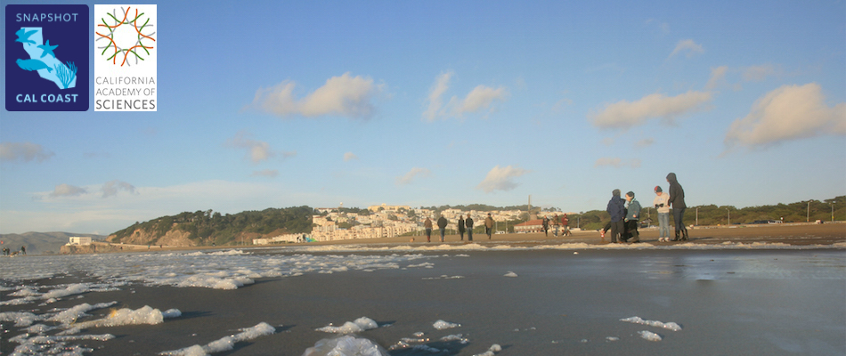

# Snapshot Cal Coast

## exploratory analysis of Snapshot Cal Coast data

###Data Sources
* [California Marine Protected Areas (GIS Data)](https://data.ca.gov/dataset/california-marine-protected-areas-ds582)
* [California Counties (GIS Data)](https://data.ca.gov/dataset/ca-geographic-boundaries)
* [Snapshot Cal Coast Observations (iNaturalist API)](https://api.inaturalist.org/v1/docs/)