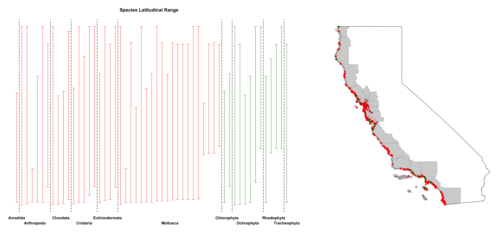

# Snapshot Cal Coast

## Exploratory analysis, Snapshot Cal Coast 2016-2018

### Data Sources
* [California Marine Protected Areas (GIS Data)](https://data.ca.gov/dataset/california-marine-protected-areas-ds582)
* [California Counties (GIS Data)](https://data.ca.gov/dataset/ca-geographic-boundaries)
* [California State Land Boundaries (GIS Data)](https://www.census.gov/geo/maps-data/data/cbf/cbf_state.html)
* [Snapshot Cal Coast Observations (iNaturalist API)](https://api.inaturalist.org/v1/docs/)

### Raw Data

#### Number of Observations

*The number of research-grade species obesrvations from the three years of Snapshot Cal Coast. Points on map are individual observations, color coded by year. The plot at the left shows the number of observations made in each year within 0.5-degree latitudinal bins. Map and plot y-axes are on the same scale.*

#### Number of Species

*The number of research-grade species identified during the three years of Snapshot Cal Coast. Points on map are individual observations, color coded by year. The plot at the left shows the number of species identified in each year within 0.5-degree latitudinal bins. Map and plot y-axes are on the same scale.*

#### Latitudinal Ranges

*Latitudinal ranges of the 53 species with at least 75 observations, cumulatively across the three three years of Snapshot Cal Coast. Points on map are individual observations, color coded by animals (red) and 'plants' (green). The latitudinal ranges are grouped by phylum and demarcated by the dashed vertical lines. Map and plot y-axes are on the same scale.*
